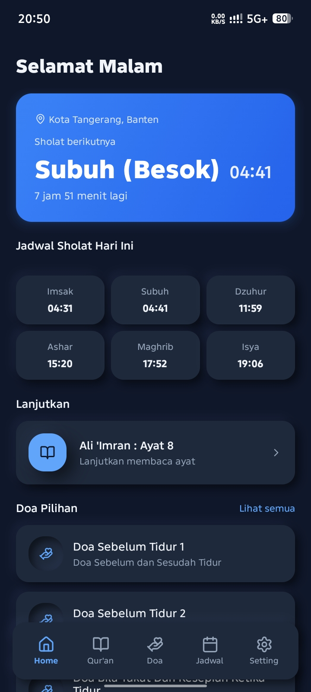
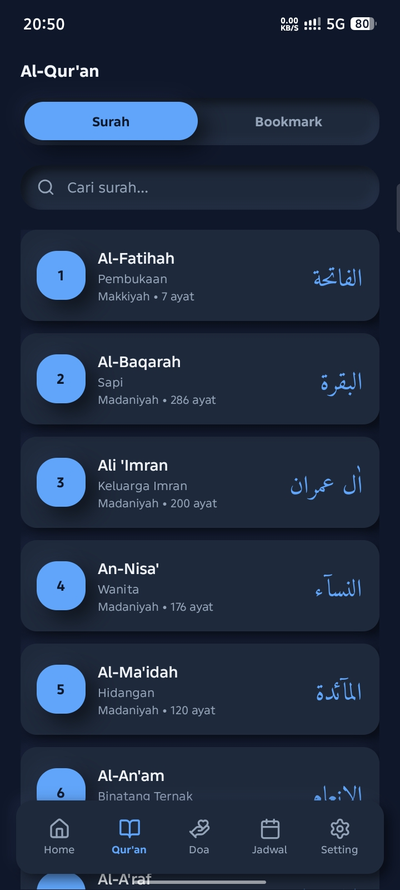
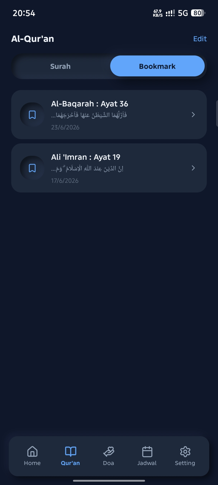
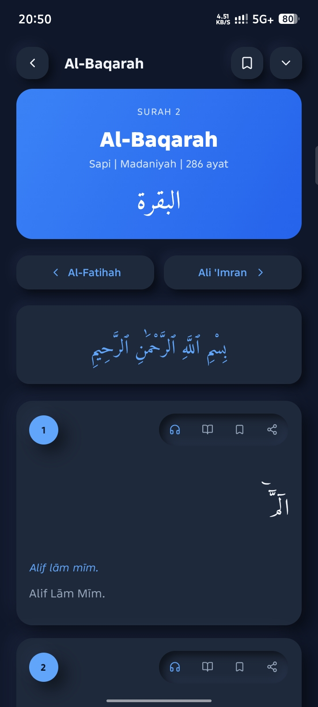
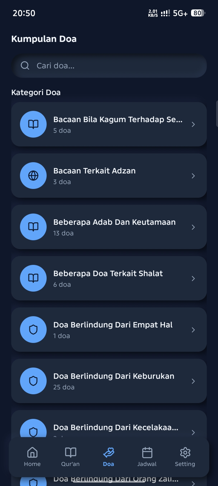
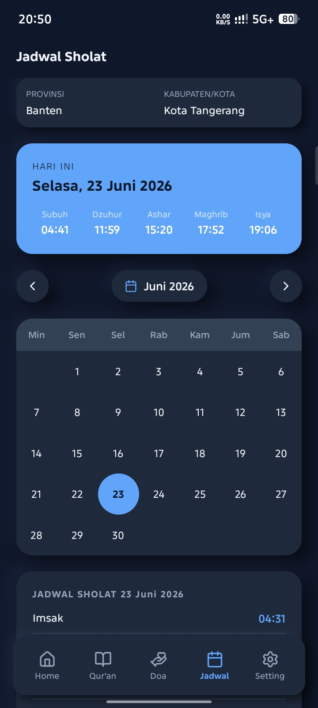
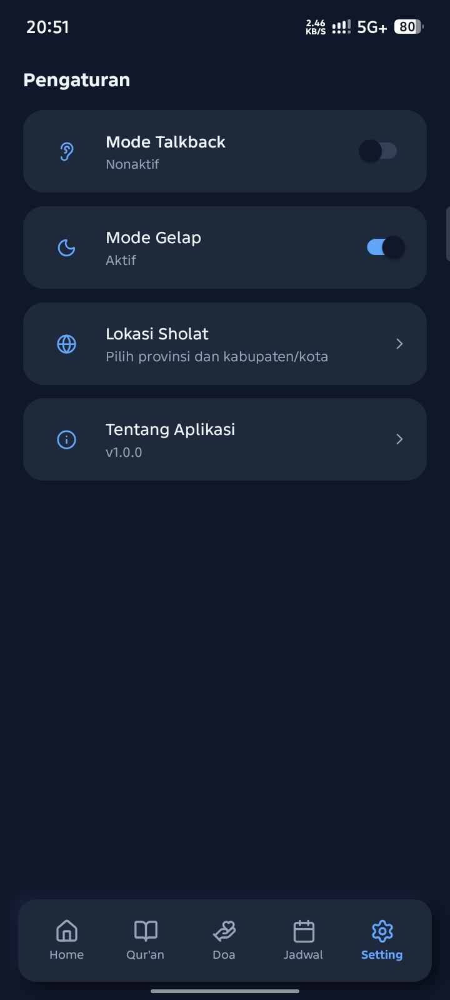

# QuranKu

Aplikasi Quran digital, doa, dan jadwal sholat berbasis Android.

---

## Tentang Aplikasi

QuranKu adalah aplikasi mobile Android yang membantu pengguna membaca Al-Qur'an, mendengarkan murattal, menghafal doa-doa harian, dan mengetahui jadwal sholat dengan mudah. Aplikasi ini dirancang untuk menemani ibadah pengguna sehari-hari dengan antarmuka yang sederhana dan nyaman digunakan.

---

## Fitur

- Al-Qur'an Digital - Membaca 30 Juz lengkap dengan teks Arab
- Tafsir - Tafsir ringkas per ayat
- Audio Murattal - Streaming murottal dari berbagai qari
- Search Bar - Pencarian ayat berdasarkan kata kunci
- Bookmark - Menyimpan dan melanjutkan bacaan ayat terakhir
- Share Ayat - Membagikan ayat ke media sosial atau aplikasi lain
- Doa Harian - Kumpulan doa sehari-hari dan doa dalam Al-Qur'an
- Jadwal Sholat - Jadwal 5 waktu + imsak berdasarkan lokasi yang dipilih, dengan fitur melihat jadwal di tanggal lain
- Dark Mode - Tampilan gelap untuk kenyamanan membaca
- Talkback (Aksesibilitas) - Dukungan screen reader untuk pengguna dengan kebutuhan khusus

---

## Screenshot

Berikut adalah tampilan dari aplikasi QuranKu:

<p align="center">
  
  
  
  
  
  
  
  
  
  
</p>

---

## Download & Instalasi

### Persyaratan Sistem

- Android 8.0 (Oreo) atau lebih tinggi
- Minimal RAM 2 GB (direkomendasikan)

### Cara Instalasi

1. Download file APK pada bagian Releases atau Assets di halaman ini
2. Buka file APK yang telah diunduh
3. Jika muncul peringatan keamanan, aktifkan Instal dari sumber tidak dikenal (Settings > Security > Unknown Sources)
4. Klik Install
5. Tunggu hingga proses instalasi selesai
6. Buka aplikasi dan mulai gunakan

### Instalasi Manual via ADB (Opsional)

```bash
adb install QuranKu-v1.0.0.apk
```

---

## Teknologi

Aplikasi ini dibangun dengan:

- **Language:** Typescript
- **Framework:** React Native Expo
- **Database:** Expo SQLite
- **Platform:** Android

---

<div align="center">
  <b>QuranKu</b> — Menemani Ibadah Setiap Hari
</div>
